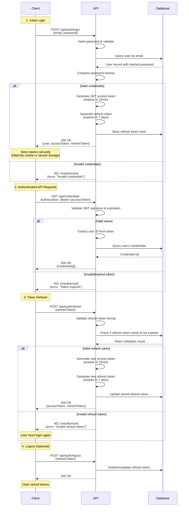

# 🚀 Team Vault - API Documentation

## 📖 Table of Contents

- [API Overview](#-api-overview)
- [Authentication](#-authentication)
- [Endpoints](#-endpoints)
- [Request Response Schemas](#-request-response-schemas)
- [Error Handling](#-error-handling)
- [Rate Limiting](#-rate-limiting)

---

## 🎯 API Overview

### 🌐 **Base Configuration**

| Environment | Base URL | Protocol |
|-------------|----------|----------|
| **Development** | `http://localhost:3000/api` | HTTP |
| **Production** | `https://api.teamvault.app/api` | HTTPS |

### 📋 **API Standards**

- **Protocol**: RESTful API design
- **Format**: JSON request/response bodies
- **Authentication**: JWT Bearer tokens
- **Versioning**: URL path versioning (`/api/v1/`)
- **Status Codes**: Standard HTTP status codes
- **Rate Limiting**: Per-user and per-endpoint limits

---

## 🔐 Authentication

### 🔑 **Authentication Flow**



### 🎫 **JWT Token Structure**

```typescript
interface JWTPayload {
  sub: string;        // User ID
  email: string;      // User email
  name: string;       // User name
  role: 'user' | 'globalAdmin';
  iat: number;        // Issued at
  exp: number;        // Expires at
}
```

### 🔒 **Authorization Levels**

| Level | Description | Endpoints |
|-------|-------------|-----------|
| **Public** | No authentication required | Login, Register, Reset Password |
| **User** | Authenticated user | Personal credentials, team access |
| **Admin** | Global administrator | User management, system settings |

---

## 🛣️ Endpoints

### 🔐 **Authentication Endpoints**

```typescript
// Authentication Routes
POST   /api/auth/register      // Create new user account
POST   /api/auth/login         // User login
POST   /api/auth/refresh       // Refresh access token
POST   /api/auth/logout        // User logout
POST   /api/auth/verify-email  // Verify email address
POST   /api/auth/forgot-password  // Request password reset
POST   /api/auth/reset-password   // Reset password with token
```

### 👥 **User Management Endpoints**

```typescript
// User Routes
GET    /api/users/me           // Get current user profile
PUT    /api/users/me           // Update current user profile
DELETE /api/users/me           // Delete current user account
GET    /api/users              // List all users (Admin only)
GET    /api/users/:id          // Get user by ID (Admin only)
PUT    /api/users/:id          // Update user by ID (Admin only)
DELETE /api/users/:id          // Delete user by ID (Admin only)
```

### 🏢 **Team Management Endpoints**

```typescript
// Team Routes
GET    /api/teams              // List user's teams
POST   /api/teams              // Create new team
GET    /api/teams/:id          // Get team details
PUT    /api/teams/:id          // Update team
DELETE /api/teams/:id          // Delete team

// Team Member Routes
GET    /api/teams/:id/members  // List team members
POST   /api/teams/:id/members  // Add team member
PUT    /api/teams/:id/members/:userId    // Update member role
DELETE /api/teams/:id/members/:userId    // Remove team member
```

### 🔑 **Credential Management Endpoints**

```typescript
// Credential Routes
GET    /api/credentials         // List user's credentials
POST   /api/credentials         // Create new credential
GET    /api/credentials/:id     // Get credential details
PUT    /api/credentials/:id     // Update credential
DELETE /api/credentials/:id     // Delete credential
GET    /api/credentials/:id/history     // Get credential history
POST   /api/credentials/:id/rotate      // Rotate credential secret

// Search and Filter
GET    /api/credentials/search?q=query&category=cat&tags=tag1,tag2
GET    /api/credentials/expiring?days=30
GET    /api/credentials/shared-with-me
```

### 🤝 **Sharing Endpoints**

```typescript
// Credential Sharing Routes
GET    /api/credentials/:id/shares       // List credential shares
POST   /api/credentials/:id/share        // Share credential
DELETE /api/credentials/:id/shares/:shareId  // Remove share

// One-Time Links
GET    /api/credentials/:id/one-time-links    // List one-time links
POST   /api/credentials/:id/one-time-links    // Create one-time link
DELETE /api/one-time-links/:linkId           // Delete one-time link

// Public Share Access
GET    /api/share/:token                     // Public: Get share info
POST   /api/share/:token/access              // Public: Access shared credential
```

### 📊 **Audit and Analytics Endpoints**

```typescript
// Audit Routes
GET    /api/audit/logs                       // Get audit logs
GET    /api/audit/logs/credential/:id        // Get credential audit logs
GET    /api/audit/logs/user/:id              // Get user audit logs

// Analytics Routes (Admin only)
GET    /api/analytics/dashboard              // Dashboard analytics
GET    /api/analytics/credentials/usage      // Credential usage stats
GET    /api/analytics/teams/activity         // Team activity stats
GET    /api/analytics/security/events        // Security event stats
```

---

## 📋 Request Response Schemas

### 🔐 **Authentication Schemas**

#### **Register Request**

```typescript
interface RegisterRequest {
  name: string;
  email: string;
  password: string;
}
```

#### **Login Request**

```typescript
interface LoginRequest {
  email: string;
  password: string;
}
```

#### **Authentication Response**

```typescript
interface AuthResponse {
  user: {
    id: string;
    name: string;
    email: string;
    role: string;
  };
  tokens: {
    accessToken: string;
    refreshToken: string;
  };
}
```

### 🔑 **Credential Schemas**

#### **Create Credential Request**

```typescript
interface CreateCredentialRequest {
  name: string;
  username?: string;
  secret: string;
  description?: string;
  category?: string;
  url?: string;
  tags?: string[];
  expirationDate?: string; // ISO date string
}
```

#### **Credential Response**

```typescript
interface CredentialResponse {
  id: string;
  name: string;
  username?: string;
  description?: string;
  category?: string;
  url?: string;
  tags: string[];
  ownerId: string;
  expirationDate?: string;
  lastRotated?: string;
  riskLevel: 'low' | 'medium' | 'high';
  createdAt: string;
  updatedAt: string;
  // Note: secret is never returned in list responses
}
```

#### **Credential with Secret Response**

```typescript
interface CredentialWithSecretResponse extends CredentialResponse {
  secret: string; // Only returned when user has proper access
}
```

### 🤝 **Sharing Schemas**

#### **Share Credential Request**

```typescript
interface ShareCredentialRequest {
  sharedWithUserId?: string;
  sharedWithTeamId?: string;
  accessLevel: 'view' | 'edit';
  expiresAt?: string; // ISO date string
}
```

#### **Create One-Time Link Request**

```typescript
interface CreateOneTimeLinkRequest {
  accessLevel: 'view' | 'edit';
  expiresAt: string; // ISO date string
  password?: string;
  maxUses?: number;
}
```

#### **One-Time Link Response**

```typescript
interface OneTimeLinkResponse {
  id: string;
  token: string;
  url: string; // Full URL to access the link
  accessLevel: 'view' | 'edit';
  expiresAt: string;
  maxUses: number;
  currentUses: number;
  createdAt: string;
}
```

### 🏢 **Team Schemas**

#### **Create Team Request**

```typescript
interface CreateTeamRequest {
  name: string;
  description?: string;
}
```

#### **Team Response**

```typescript
interface TeamResponse {
  id: string;
  name: string;
  description?: string;
  createdBy: string;
  createdAt: string;
  updatedAt: string;
  memberCount: number;
}
```

#### **Add Team Member Request**

```typescript
interface AddTeamMemberRequest {
  email: string;
  role: 'viewer' | 'editor' | 'admin';
}
```

---

## ❌ Error Handling

### 🚨 **Error Response Format**

```typescript
interface ErrorResponse {
  error: {
    code: string;
    message: string;
    details?: any;
  };
  timestamp: string;
  path: string;
}
```

### 📋 **Standard Error Codes**

| HTTP Status | Error Code | Description |
|-------------|------------|-------------|
| **400** | `VALIDATION_ERROR` | Request validation failed |
| **401** | `UNAUTHORIZED` | Authentication required |
| **403** | `FORBIDDEN` | Access denied |
| **404** | `NOT_FOUND` | Resource not found |
| **409** | `CONFLICT` | Resource conflict (duplicate email) |
| **422** | `UNPROCESSABLE_ENTITY` | Business logic validation failed |
| **429** | `RATE_LIMITED` | Too many requests |
| **500** | `INTERNAL_ERROR` | Server error |

### 📝 **Error Examples**

#### **Validation Error**

```json
{
  "error": {
    "code": "VALIDATION_ERROR",
    "message": "Request validation failed",
    "details": {
      "field": "email",
      "reason": "Invalid email format"
    }
  },
  "timestamp": "2025-01-15T10:30:00Z",
  "path": "/api/auth/register"
}
```

#### **Authentication Error**

```json
{
  "error": {
    "code": "UNAUTHORIZED",
    "message": "Invalid or expired token"
  },
  "timestamp": "2025-01-15T10:30:00Z",
  "path": "/api/credentials"
}
```

#### **Access Denied Error**

```json
{
  "error": {
    "code": "FORBIDDEN",
    "message": "Insufficient permissions to access this resource"
  },
  "timestamp": "2025-01-15T10:30:00Z",
  "path": "/api/credentials/123"
}
```

---

## 🚦 Rate Limiting

### 📊 **Rate Limit Configuration**

| Endpoint Category | Limit | Window | Blocking Duration |
|-------------------|-------|--------|-------------------|
| **Authentication** | 5 attempts | 15 minutes | 15 minutes |
| **General API** | 100 requests | 1 minute | 1 minute |
| **Search** | 20 requests | 1 minute | 1 minute |
| **File Upload** | 5 requests | 5 minutes | 5 minutes |

### 🔍 **Rate Limit Headers**

```http
X-RateLimit-Limit: 100
X-RateLimit-Remaining: 85
X-RateLimit-Reset: 1642258800
X-RateLimit-Retry-After: 60
```

### 🚨 **Rate Limit Response**

```json
{
  "error": {
    "code": "RATE_LIMITED",
    "message": "Too many requests. Please try again later.",
    "details": {
      "retryAfter": 60
    }
  },
  "timestamp": "2025-01-15T10:30:00Z",
  "path": "/api/credentials"
}
```

---

## 🔧 Implementation Examples

### 📝 **Making API Requests**

#### **JavaScript/TypeScript Example**

```typescript
// API Service Class
class TeamVaultAPI {
  private baseUrl = 'https://api.teamvault.app/api';
  private accessToken: string | null = null;

  async login(email: string, password: string): Promise<AuthResponse> {
    const response = await fetch(`${this.baseUrl}/auth/login`, {
      method: 'POST',
      headers: {
        'Content-Type': 'application/json',
      },
      body: JSON.stringify({ email, password }),
    });

    if (!response.ok) {
      throw new Error('Login failed');
    }

    const data = await response.json();
    this.accessToken = data.tokens.accessToken;
    return data;
  }

  async getCredentials(): Promise<CredentialResponse[]> {
    const response = await fetch(`${this.baseUrl}/credentials`, {
      headers: {
        'Authorization': `Bearer ${this.accessToken}`,
        'Content-Type': 'application/json',
      },
    });

    if (!response.ok) {
      throw new Error('Failed to fetch credentials');
    }

    return response.json();
  }

  async createCredential(data: CreateCredentialRequest): Promise<CredentialResponse> {
    const response = await fetch(`${this.baseUrl}/credentials`, {
      method: 'POST',
      headers: {
        'Authorization': `Bearer ${this.accessToken}`,
        'Content-Type': 'application/json',
      },
      body: JSON.stringify(data),
    });

    if (!response.ok) {
      throw new Error('Failed to create credential');
    }

    return response.json();
  }
}
```

#### **cURL Examples**

```bash
# Login
curl -X POST https://api.teamvault.app/api/auth/login \
  -H "Content-Type: application/json" \
  -d '{"email":"user@example.com","password":"password123"}'

# Get credentials
curl -X GET https://api.teamvault.app/api/credentials \
  -H "Authorization: Bearer YOUR_ACCESS_TOKEN"

# Create credential
curl -X POST https://api.teamvault.app/api/credentials \
  -H "Authorization: Bearer YOUR_ACCESS_TOKEN" \
  -H "Content-Type: application/json" \
  -d '{
    "name": "Database Password",
    "username": "db_user",
    "secret": "encrypted_secret_here",
    "category": "Database",
    "expirationDate": "2025-12-31T23:59:59Z"
  }'
```

---

*This API documentation provides comprehensive guidance for integrating with Team Vault. Keep this document updated as the API evolves.*
