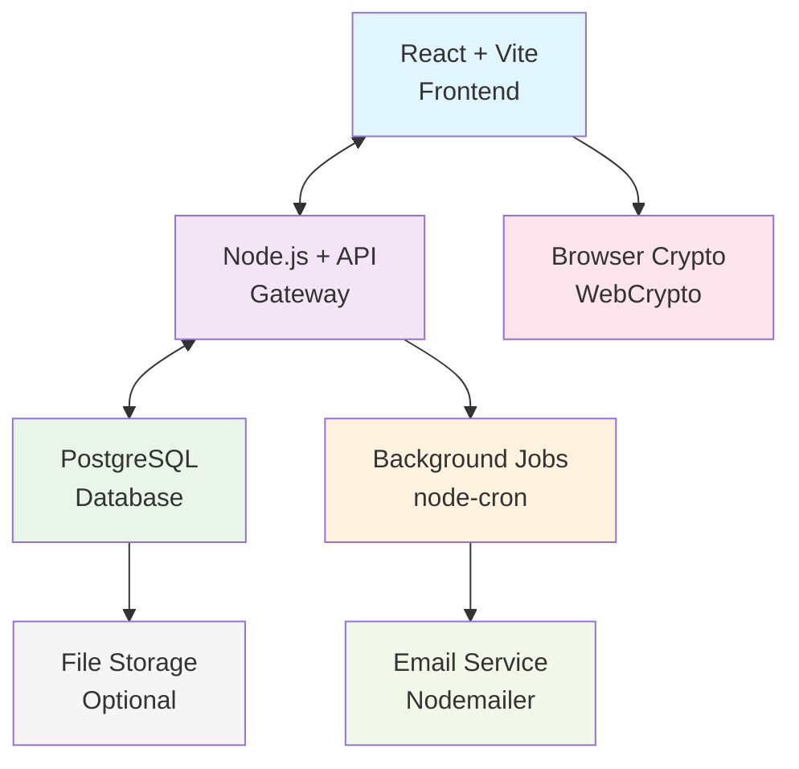
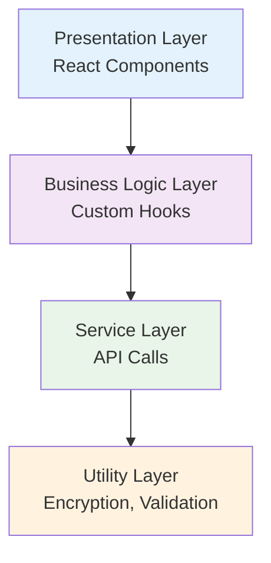
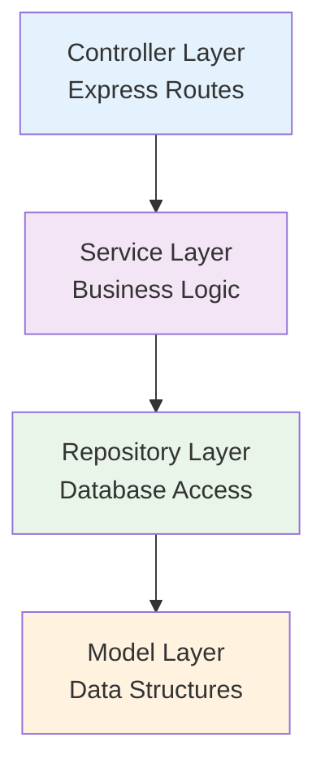
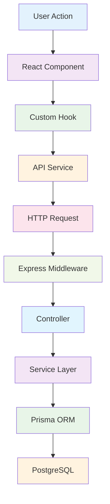
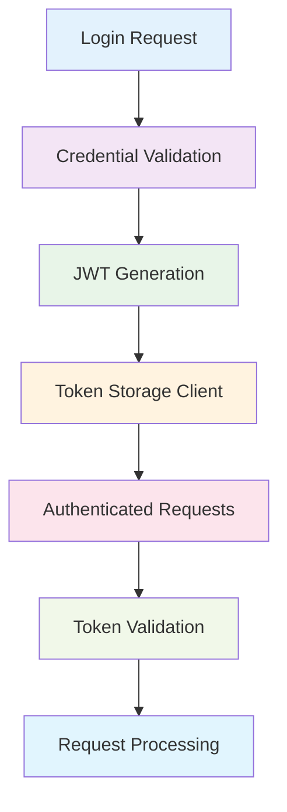

# 🏗️ Team Vault - System Architecture

## 📖 Table of Contents

- [Architecture Overview](#-architecture-overview)
- [Component Design](#-component-design)
- [Technology Stack](#-technology-stack)
- [Scalability Strategy](#-scalability-strategy)
- [Integration Points](#-integration-points)

---

## 🎯 Architecture Overview

### 🌐 **High-Level System Architecture**



### 🧩 **Component Overview**

| Component | Technology | Purpose | Scalability |
|-----------|------------|---------|-------------|
| **Frontend** | React + Vite + TypeScript | User interface and client-side encryption | Horizontal via CDN |
| **API Gateway** | Node.js + Express + TypeScript | Business logic and API endpoints | Horizontal via load balancer |
| **Database** | PostgreSQL + Prisma ORM | Data persistence and relationships | Vertical + read replicas |
| **Background Jobs** | node-cron | Scheduled tasks and notifications | Horizontal via job queues |
| **Email Service** | Nodemailer + SMTP | Notifications and invitations | External service |
| **File Storage** | Local/S3 (future) | Static assets and backups | Cloud-native scaling |

---

## 🏛️ Component Design

### 🎨 **Frontend Architecture**

#### **Frontend Layer Structure**



#### **Frontend Key Patterns**

- **Component Composition**: Reusable UI primitives
- **Custom Hooks**: Encapsulated business logic
- **Context API**: Global state management
- **Code Splitting**: Route-based lazy loading
- **Presentational Components**: Presentational and Smart components

### ⚙️ **Backend Architecture**

#### **Backend Layer Structure**



#### **Backend Key Patterns**

- **Dependency Injection**: Service composition
- **Middleware Pipeline**: Request processing
- **Repository Pattern**: Data access abstraction
- **Command/Query Separation**: Read/write operations

---

## 🛠️ Technology Stack

### 🧑‍💻 **Frontend Technologies**

| Technology | Version | Purpose | Justification |
|------------|---------|---------|---------------|
| **React** | 19+ | UI Framework | Component-based, mature ecosystem |
| **Vite** | 5+ | Build Tool | Fast HMR, optimized production builds |
| **TypeScript** | 5+ | Type Safety | Compile-time error checking |
| **TailwindCSS** | 3+ | Styling | Utility-first, rapid development |
| **React Hook Form** | 7+ | Form Management | Performance, minimal re-renders |
| **React Router** | 6+ | Routing | Declarative routing, nested routes |

### 🖥️ **Backend Technologies**

| Technology | Version | Purpose | Justification |
|------------|---------|---------|---------------|
| **Node.js** | 22+ | Runtime | JavaScript ecosystem, async I/O |
| **Express** | 4+ | Web Framework | Minimal, flexible, middleware support |
| **TypeScript** | 5+ | Type Safety | Shared types with frontend |
| **Prisma** | 5+ | ORM | Type-safe queries, migrations |
| **PostgreSQL** | 14+ | Database | ACID compliance, JSON support |
| **JWT** | - | Authentication | Stateless, scalable auth |

### 🔐 **Security Technologies**

| Technology | Purpose | Implementation |
|------------|---------|----------------|
| **WebCrypto API** | Client-side encryption | Browser-native encryption |
| **Node.js Crypto** | Server-side encryption | AES-256-GCM encryption |
| **Helmet.js** | Security headers | XSS, CSP, HSTS protection |
| **Rate Limiter** | DDoS protection | Redis-based rate limiting |
| **bcrypt/argon2** | Password hashing | Secure password storage |

---

## 📈 Scalability Strategy

### 🔄 **Horizontal Scaling**

#### **Frontend Scaling**

- **CDN Distribution**: Static asset caching
- **Geographic Distribution**: Multi-region deployment
- **Code Splitting**: Reduced initial bundle size
- **Progressive Loading**: On-demand resource loading

#### **Backend Scaling**

- **Load Balancing**: Multi-instance deployment
- **Stateless Design**: No server-side sessions
- **Database Connection Pooling**: Efficient resource usage
- **Microservice Ready**: Service separation capability

### 📊 **Performance Optimization**

#### **Database Optimization**

- **Strategic Indexing**: Query performance
- **Connection Pooling**: Resource management
- **Read Replicas**: Read operation scaling
- **Query Optimization**: Efficient data retrieval

#### **Caching Strategy**

- **Client-Side Caching**: Browser storage
- **API Response Caching**: Redis implementation
- **CDN Caching**: Static asset delivery
- **Database Query Caching**: Prisma query caching

---

## 🔗 Integration Points

### 📧 **Email Service Integration**

```typescript
interface EmailServiceConfig {
  provider: 'sendgrid' | 'smtp' | 'ses';
  credentials: {
    apiKey?: string;
    username?: string;
    password?: string;
  };
  templates: {
    welcome: string;
    passwordReset: string;
    credentialExpiry: string;
    teamInvitation: string;
  };
}
```

### 🗄️ **Database Integration**

```typescript
interface DatabaseConfig {
  provider: 'postgresql' | 'mysql' | 'sqlite';
  url: string;
  pool: {
    min: number;
    max: number;
    idle: number;
  };
  ssl: boolean;
  logging: boolean;
}
```

### 🔐 **Authentication Integration**

```typescript
interface AuthConfig {
  jwt: {
    secret: string;
    expiresIn: string;
    refreshExpiresIn: string;
  };
  oauth?: {
    google?: OAuthConfig;
    github?: OAuthConfig;
    microsoft?: OAuthConfig;
  };
  mfa: {
    enabled: boolean;
    methods: ('totp' | 'sms' | 'email')[];
  };
}
```

---

## 🚀 Deployment Architecture

### 🌐 **Production Environment**



```mermaid
graph TB
    Internet[Internet]
    CDN[Cloudflare CDN<br/>Global CDN & DDoS Protection]
    Frontend[Vercel<br/>Frontend]
    Backend[Railway<br/>Backend]
    Database[Supabase<br/>PostgreSQL]
    Email[SendGrid<br/>Email]
    CICD[GitHub Actions<br/>CI/CD]
    Monitor[Monitoring<br/>Uptime Robot]

    Internet --> CDN
    CDN --> Frontend
    Frontend <--> Backend
    Backend <--> Database
    Backend --> Email
    CICD --> Frontend
    CICD --> Backend
    Monitor --> Frontend
    Monitor --> Backend

    style Internet fill:#f9f9f9
    style CDN fill:#ff6b35
    style Frontend fill:#00d4aa
    style Backend fill:#5b67d8
    style Database fill:#38a169
    style Email fill:#ed8936
    style CICD fill:#2d3748
    style Monitor fill:#e53e3e
```

### 🏗️ **Development Environment**

```mermaid
graph TB
    Dev[Local Development]
    ViteDev[Vite Dev Server<br/>localhost:5173]
    ExpressDev[Express Dev Server<br/>localhost:3000]
    LocalDB[PostgreSQL<br/>Local DB<br/>localhost:5432]
    Mailtrap[Mailtrap<br/>Email Testing]
    HotReload[Hot Reload<br/>& Type Check]
    PrismaStudio[Prisma<br/>Studio]

    Dev --> ViteDev
    Dev --> ExpressDev
    Dev --> LocalDB
    ViteDev <--> ExpressDev
    ExpressDev <--> LocalDB
    ExpressDev --> Mailtrap
    ViteDev --> HotReload
    LocalDB --> PrismaStudio

    style Dev fill:#f7fafc
    style ViteDev fill:#646cff
    style ExpressDev fill:#68d391
    style LocalDB fill:#4299e1
    style Mailtrap fill:#f6ad55
    style HotReload fill:#ed8936
    style PrismaStudio fill:#2d3748
```



---

## 🔄 Data Flow Architecture

### 📊 **Request Flow**



### 🔐 **Authentication Flow**



---

*This architecture document provides the foundational design for Team Vault. It should be referenced during development and updated as the system evolves.*
