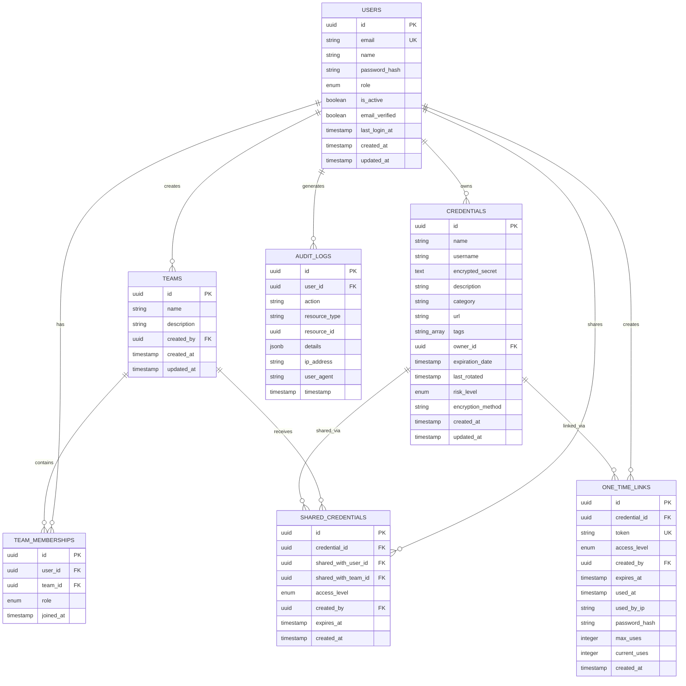
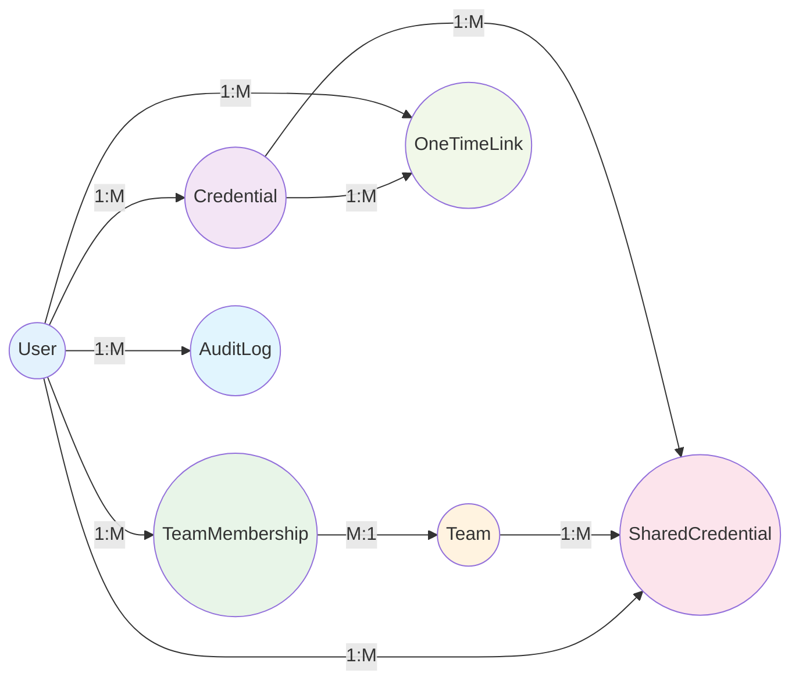

# 🗄️ Team Vault - Database Schema

## 📖 Table of Contents

- [Database Overview](#-database-overview)
- [Core Tables](#-core-tables)
- [Relationships](#-relationships)
- [Prisma Schema](#-prisma-schema)
- [Indexes and Performance](#-indexes-and-performance)
- [Migration Strategy](#-migration-strategy)

---

## 🎯 Database Overview

### 📊 **Entity Relationship Diagram**



### 🗂️ **Database Design Principles**

- **Normalization**: Third normal form with strategic denormalization
- **Security**: No plain text secrets, comprehensive audit logging
- **Performance**: Strategic indexing and query optimization
- **Scalability**: UUID primary keys, efficient relationships
- **Compliance**: Full audit trail for security compliance

---

## 📋 Core Tables

### 👥 **Users Table**

```sql
CREATE TABLE users (
  id UUID PRIMARY KEY DEFAULT gen_random_uuid(),
  email VARCHAR(255) UNIQUE NOT NULL,
  name VARCHAR(255) NOT NULL,
  password_hash VARCHAR(255) NOT NULL,
  role VARCHAR(50) DEFAULT 'user' CHECK (role IN ('user', 'globalAdmin')),
  is_active BOOLEAN DEFAULT true,
  email_verified BOOLEAN DEFAULT false,
  last_login_at TIMESTAMP,
  created_at TIMESTAMP DEFAULT CURRENT_TIMESTAMP,
  updated_at TIMESTAMP DEFAULT CURRENT_TIMESTAMP
);

-- Indexes
CREATE INDEX idx_users_email ON users(email);
CREATE INDEX idx_users_role ON users(role);
CREATE INDEX idx_users_active ON users(is_active);
```

**Purpose**: Core user management with role-based access control
**Key Features**: Email verification, activity tracking, role management

### 🏢 **Teams Table**

```sql
CREATE TABLE teams (
  id UUID PRIMARY KEY DEFAULT gen_random_uuid(),
  name VARCHAR(255) NOT NULL,
  description TEXT,
  created_by UUID NOT NULL REFERENCES users(id) ON DELETE CASCADE,
  created_at TIMESTAMP DEFAULT CURRENT_TIMESTAMP,
  updated_at TIMESTAMP DEFAULT CURRENT_TIMESTAMP
);

-- Indexes
CREATE INDEX idx_teams_created_by ON teams(created_by);
```

**Purpose**: Team organization for credential sharing
**Key Features**: Team ownership, hierarchical permissions

### 👤 **Team Memberships Table**

```sql
CREATE TABLE team_memberships (
  id UUID PRIMARY KEY DEFAULT gen_random_uuid(),
  user_id UUID NOT NULL REFERENCES users(id) ON DELETE CASCADE,
  team_id UUID NOT NULL REFERENCES teams(id) ON DELETE CASCADE,
  role VARCHAR(50) DEFAULT 'viewer' CHECK (role IN ('viewer', 'editor', 'admin')),
  joined_at TIMESTAMP DEFAULT CURRENT_TIMESTAMP,
  UNIQUE(user_id, team_id)
);

-- Indexes
CREATE INDEX idx_team_memberships_user ON team_memberships(user_id);
CREATE INDEX idx_team_memberships_team ON team_memberships(team_id);
```

**Purpose**: Many-to-many relationship between users and teams
**Key Features**: Role-based team permissions, unique membership constraint

### 🔐 **Credentials Table**

```sql
CREATE TABLE credentials (
  id UUID PRIMARY KEY DEFAULT gen_random_uuid(),
  name VARCHAR(255) NOT NULL,
  username VARCHAR(255),
  encrypted_secret TEXT NOT NULL,
  description TEXT,
  category VARCHAR(100),
  url VARCHAR(500),
  tags TEXT[], -- PostgreSQL array type
  owner_id UUID NOT NULL REFERENCES users(id) ON DELETE CASCADE,
  expiration_date TIMESTAMP,
  last_rotated TIMESTAMP,
  risk_level VARCHAR(50) DEFAULT 'low' CHECK (risk_level IN ('low', 'medium', 'high')),
  encryption_method VARCHAR(50) DEFAULT 'aes-256-gcm',
  created_at TIMESTAMP DEFAULT CURRENT_TIMESTAMP,
  updated_at TIMESTAMP DEFAULT CURRENT_TIMESTAMP
);

-- Indexes
CREATE INDEX idx_credentials_owner ON credentials(owner_id);
CREATE INDEX idx_credentials_category ON credentials(category);
CREATE INDEX idx_credentials_expiration ON credentials(expiration_date);
CREATE INDEX idx_credentials_tags ON credentials USING GIN(tags);
```

**Purpose**: Secure credential storage with metadata
**Key Features**: Encrypted secrets, expiration tracking, risk assessment, tagging

### 🤝 **Shared Credentials Table**

```sql
CREATE TABLE shared_credentials (
  id UUID PRIMARY KEY DEFAULT gen_random_uuid(),
  credential_id UUID NOT NULL REFERENCES credentials(id) ON DELETE CASCADE,
  shared_with_user_id UUID REFERENCES users(id) ON DELETE CASCADE,
  shared_with_team_id UUID REFERENCES teams(id) ON DELETE CASCADE,
  access_level VARCHAR(50) DEFAULT 'view' CHECK (access_level IN ('view', 'edit')),
  created_by UUID NOT NULL REFERENCES users(id) ON DELETE CASCADE,
  expires_at TIMESTAMP,
  created_at TIMESTAMP DEFAULT CURRENT_TIMESTAMP,
  CHECK (
    (shared_with_user_id IS NOT NULL AND shared_with_team_id IS NULL) OR
    (shared_with_user_id IS NULL AND shared_with_team_id IS NOT NULL)
  )
);

-- Indexes
CREATE INDEX idx_shared_credentials_credential ON shared_credentials(credential_id);
CREATE INDEX idx_shared_credentials_user ON shared_credentials(shared_with_user_id);
CREATE INDEX idx_shared_credentials_team ON shared_credentials(shared_with_team_id);
```

**Purpose**: Credential sharing with granular permissions
**Key Features**: User or team sharing, access level control, expiration dates

### 🔗 **One-Time Share Links Table**

```sql
CREATE TABLE one_time_links (
  id UUID PRIMARY KEY DEFAULT gen_random_uuid(),
  credential_id UUID NOT NULL REFERENCES credentials(id) ON DELETE CASCADE,
  token VARCHAR(255) UNIQUE NOT NULL,
  access_level VARCHAR(50) DEFAULT 'view' CHECK (access_level IN ('view', 'edit')),
  created_by UUID NOT NULL REFERENCES users(id) ON DELETE CASCADE,
  expires_at TIMESTAMP NOT NULL,
  used_at TIMESTAMP,
  used_by_ip VARCHAR(45),
  password_hash VARCHAR(255), -- Optional password protection
  max_uses INTEGER DEFAULT 1,
  current_uses INTEGER DEFAULT 0,
  created_at TIMESTAMP DEFAULT CURRENT_TIMESTAMP
);

-- Indexes
CREATE INDEX idx_one_time_links_token ON one_time_links(token);
CREATE INDEX idx_one_time_links_credential ON one_time_links(credential_id);
CREATE INDEX idx_one_time_links_expires ON one_time_links(expires_at);
```

**Purpose**: Temporary credential sharing via secure links
**Key Features**: Token-based access, usage tracking, optional password protection

### 📋 **Audit Logs Table**

```sql
CREATE TABLE audit_logs (
  id UUID PRIMARY KEY DEFAULT gen_random_uuid(),
  user_id UUID REFERENCES users(id) ON DELETE SET NULL,
  action VARCHAR(100) NOT NULL,
  resource_type VARCHAR(50) NOT NULL,
  resource_id UUID,
  details JSONB,
  ip_address VARCHAR(45),
  user_agent TEXT,
  timestamp TIMESTAMP DEFAULT CURRENT_TIMESTAMP
);

-- Indexes
CREATE INDEX idx_audit_logs_user ON audit_logs(user_id);
CREATE INDEX idx_audit_logs_resource ON audit_logs(resource_type, resource_id);
CREATE INDEX idx_audit_logs_timestamp ON audit_logs(timestamp);
CREATE INDEX idx_audit_logs_action ON audit_logs(action);
```

**Purpose**: Comprehensive audit trail for security and compliance
**Key Features**: Action tracking, metadata storage, IP and browser tracking

---

## 🔗 Relationships

### 📊 **Entity Relationships**



### 🔄 **Cascade Rules**

| Table | Foreign Key | On Delete | Reasoning |
|-------|------------|-----------|-----------|
| **Credentials** | owner_id | CASCADE | Remove orphaned credentials |
| **TeamMemberships** | user_id, team_id | CASCADE | Clean up memberships |
| **SharedCredentials** | credential_id | CASCADE | Remove invalid shares |
| **SharedCredentials** | shared_with_* | CASCADE | Clean up user/team removal |
| **OneTimeLinks** | credential_id | CASCADE | Remove invalid links |
| **AuditLogs** | user_id | SET NULL | Preserve audit trail |

---

## 🗄️ Prisma Schema

```prisma
// prisma/schema.prisma
generator client {
  provider = "prisma-client-js"
}

datasource db {
  provider = "postgresql"
  url      = env("DATABASE_URL")
}

model User {
  id              String   @id @default(dbgenerated("gen_random_uuid()")) @db.Uuid
  email           String   @unique
  name            String
  passwordHash    String   @map("password_hash")
  role            Role     @default(USER)
  isActive        Boolean  @default(true) @map("is_active")
  emailVerified   Boolean  @default(false) @map("email_verified")
  lastLoginAt     DateTime? @map("last_login_at")
  createdAt       DateTime @default(now()) @map("created_at")
  updatedAt       DateTime @updatedAt @map("updated_at")

  // Relations
  credentials     Credential[]
  teamMemberships TeamMembership[]
  createdTeams    Team[]
  sharedCredentials SharedCredential[]
  oneTimeLinks    OneTimeLink[]
  auditLogs       AuditLog[]

  @@map("users")
}

model Team {
  id          String   @id @default(dbgenerated("gen_random_uuid()")) @db.Uuid
  name        String
  description String?
  createdBy   String   @map("created_by") @db.Uuid
  createdAt   DateTime @default(now()) @map("created_at")
  updatedAt   DateTime @updatedAt @map("updated_at")

  // Relations
  creator     User             @relation(fields: [createdBy], references: [id], onDelete: Cascade)
  members     TeamMembership[]
  sharedCredentials SharedCredential[]

  @@map("teams")
}

model TeamMembership {
  id       String   @id @default(dbgenerated("gen_random_uuid()")) @db.Uuid
  userId   String   @map("user_id") @db.Uuid
  teamId   String   @map("team_id") @db.Uuid
  role     TeamRole @default(VIEWER)
  joinedAt DateTime @default(now()) @map("joined_at")

  // Relations
  user User @relation(fields: [userId], references: [id], onDelete: Cascade)
  team Team @relation(fields: [teamId], references: [id], onDelete: Cascade)

  @@unique([userId, teamId])
  @@map("team_memberships")
}

model Credential {
  id               String    @id @default(dbgenerated("gen_random_uuid()")) @db.Uuid
  name             String
  username         String?
  encryptedSecret  String    @map("encrypted_secret")
  description      String?
  category         String?
  url              String?
  tags             String[]
  ownerId          String    @map("owner_id") @db.Uuid
  expirationDate   DateTime? @map("expiration_date")
  lastRotated      DateTime? @map("last_rotated")
  riskLevel        RiskLevel @default(LOW) @map("risk_level")
  encryptionMethod String    @default("aes-256-gcm") @map("encryption_method")
  createdAt        DateTime  @default(now()) @map("created_at")
  updatedAt        DateTime  @updatedAt @map("updated_at")

  // Relations
  owner           User               @relation(fields: [ownerId], references: [id], onDelete: Cascade)
  sharedWith      SharedCredential[]
  oneTimeLinks    OneTimeLink[]

  @@map("credentials")
}

model SharedCredential {
  id               String      @id @default(dbgenerated("gen_random_uuid()")) @db.Uuid
  credentialId     String      @map("credential_id") @db.Uuid
  sharedWithUserId String?     @map("shared_with_user_id") @db.Uuid
  sharedWithTeamId String?     @map("shared_with_team_id") @db.Uuid
  accessLevel      AccessLevel @default(VIEW) @map("access_level")
  createdBy        String      @map("created_by") @db.Uuid
  expiresAt        DateTime?   @map("expires_at")
  createdAt        DateTime    @default(now()) @map("created_at")

  // Relations
  credential     Credential @relation(fields: [credentialId], references: [id], onDelete: Cascade)
  sharedWithUser User?      @relation(fields: [sharedWithUserId], references: [id], onDelete: Cascade)
  sharedWithTeam Team?      @relation(fields: [sharedWithTeamId], references: [id], onDelete: Cascade)
  creator        User       @relation(fields: [createdBy], references: [id], onDelete: Cascade)

  @@map("shared_credentials")
}

model OneTimeLink {
  id           String      @id @default(dbgenerated("gen_random_uuid()")) @db.Uuid
  credentialId String      @map("credential_id") @db.Uuid
  token        String      @unique
  accessLevel  AccessLevel @default(VIEW) @map("access_level")
  createdBy    String      @map("created_by") @db.Uuid
  expiresAt    DateTime    @map("expires_at")
  usedAt       DateTime?   @map("used_at")
  usedByIp     String?     @map("used_by_ip")
  passwordHash String?     @map("password_hash")
  maxUses      Int         @default(1) @map("max_uses")
  currentUses  Int         @default(0) @map("current_uses")
  createdAt    DateTime    @default(now()) @map("created_at")

  // Relations
  credential Credential @relation(fields: [credentialId], references: [id], onDelete: Cascade)
  creator    User       @relation(fields: [createdBy], references: [id], onDelete: Cascade)

  @@map("one_time_links")
}

model AuditLog {
  id           String    @id @default(dbgenerated("gen_random_uuid()")) @db.Uuid
  userId       String?   @map("user_id") @db.Uuid
  action       String
  resourceType String    @map("resource_type")
  resourceId   String?   @map("resource_id") @db.Uuid
  details      Json?
  ipAddress    String?   @map("ip_address")
  userAgent    String?   @map("user_agent")
  timestamp    DateTime  @default(now())

  // Relations
  user User? @relation(fields: [userId], references: [id], onDelete: SetNull)

  @@map("audit_logs")
}

// Enums
enum Role {
  USER
  GLOBAL_ADMIN
}

enum TeamRole {
  VIEWER
  EDITOR
  ADMIN
}

enum AccessLevel {
  VIEW
  EDIT
}

enum RiskLevel {
  LOW
  MEDIUM
  HIGH
}
```

---

## 📊 Indexes and Performance

### 🚀 **Query Optimization Strategy**

#### **Primary Queries**

1. **User Credentials**: `SELECT * FROM credentials WHERE owner_id = ?`
2. **Shared Credentials**: Complex join across credentials, shared_credentials, users/teams
3. **Expiring Credentials**: `SELECT * FROM credentials WHERE expiration_date < ?`
4. **Audit Search**: `SELECT * FROM audit_logs WHERE user_id = ? AND timestamp > ?`

#### **Index Strategy**

```sql
-- Performance-critical indexes
CREATE INDEX CONCURRENTLY idx_credentials_owner_category ON credentials(owner_id, category);
CREATE INDEX CONCURRENTLY idx_credentials_expiration_risk ON credentials(expiration_date, risk_level);
CREATE INDEX CONCURRENTLY idx_shared_credentials_composite ON shared_credentials(credential_id, shared_with_user_id, shared_with_team_id);
CREATE INDEX CONCURRENTLY idx_audit_logs_user_timestamp ON audit_logs(user_id, timestamp DESC);

-- Full-text search indexes
CREATE INDEX CONCURRENTLY idx_credentials_search ON credentials USING GIN(to_tsvector('english', name || ' ' || COALESCE(description, '')));
```

#### **Query Performance Targets**

| Query Type | Target | Measurement |
|------------|--------|-------------|
| **User Login** | < 50ms | Authentication queries |
| **Credential List** | < 100ms | Dashboard loading |
| **Search Results** | < 200ms | Full-text search |
| **Audit Queries** | < 300ms | Administrative reports |

---

## 🔄 Migration Strategy

### 📋 **Migration Process**

#### **Development Migrations**

```bash
# Create new migration
npx prisma migrate dev --name add_credential_tags

# Reset database (development only)
npx prisma migrate reset

# Generate client
npx prisma generate
```

#### **Production Migrations**

```bash
# Deploy migrations
npx prisma migrate deploy

# Verify migration status
npx prisma migrate status
```

### 🛠️ **Migration Scripts**

#### **Data Migration Example**

```typescript
// migrations/add-default-categories.ts
import { PrismaClient } from '@prisma/client';

const prisma = new PrismaClient();

async function addDefaultCategories() {
  const defaultCategories = [
    'Web Services',
    'Databases',
    'Cloud Platforms',
    'Development Tools',
    'Email Services'
  ];

  // Update existing credentials without categories
  await prisma.credential.updateMany({
    where: { category: null },
    data: { category: 'Web Services' }
  });

  console.log('Default categories added successfully');
}

addDefaultCategories()
  .catch(console.error)
  .finally(() => prisma.$disconnect());
```

#### **Index Creation Script**

```sql
-- migrations/add-performance-indexes.sql
BEGIN;

-- Add indexes concurrently to avoid blocking
CREATE INDEX CONCURRENTLY IF NOT EXISTS idx_credentials_owner_expiration 
ON credentials(owner_id, expiration_date) 
WHERE expiration_date IS NOT NULL;

CREATE INDEX CONCURRENTLY IF NOT EXISTS idx_audit_logs_resource 
ON audit_logs(resource_type, resource_id, timestamp DESC);

COMMIT;
```

### 🔒 **Data Security Migrations**

#### **Encryption Upgrade Script**

```typescript
// migrations/upgrade-encryption.ts
import { PrismaClient } from '@prisma/client';
import { EncryptionService } from '../src/services/encryption.service';

const prisma = new PrismaClient();
const encryptionService = new EncryptionService();

async function upgradeEncryption() {
  const credentials = await prisma.credential.findMany({
    where: { encryptionMethod: 'aes-256-cbc' }
  });

  for (const credential of credentials) {
    // Decrypt with old method
    const decrypted = oldEncryptionService.decrypt(credential.encryptedSecret);
    
    // Re-encrypt with new method
    const reencrypted = encryptionService.encrypt(decrypted);
    
    await prisma.credential.update({
      where: { id: credential.id },
      data: {
        encryptedSecret: reencrypted,
        encryptionMethod: 'aes-256-gcm'
      }
    });
  }

  console.log(`Upgraded encryption for ${credentials.length} credentials`);
}
```

---

*This database schema provides the foundation for secure, scalable credential management. It should be reviewed and updated as requirements evolve.*
