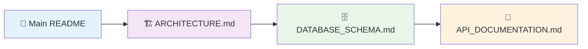
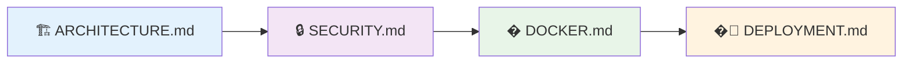
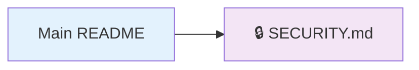
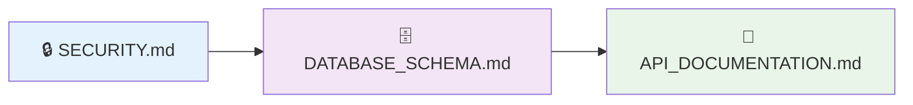
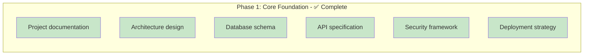
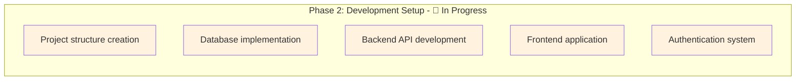
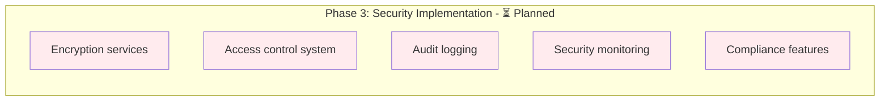
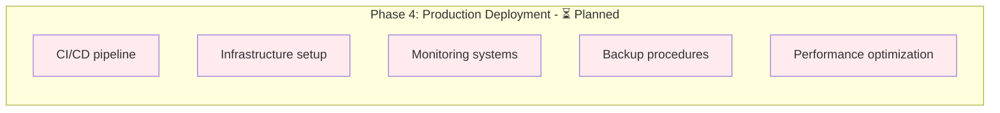

# 📚 Team Vault - Documentation Index

Welcome to the Team Vault documentation! This collection of documents provides comprehensive guidance for understanding, implementing, and maintaining the Team Vault credential management platform.

## 📖 Documentation Structure

### 🏗️ **Architecture & Design**

- **[System Architecture](./ARCHITECTURE.md)** - High-level system design, technology stack, and scalability strategy
- **[Database Schema](./DATABASE_SCHEMA.md)** - Complete database design, relationships, and migration strategies
- **[Security Architecture](./SECURITY.md)** - Comprehensive security implementation, encryption, and compliance

### 🚀 **Implementation Guides**

- **[API Documentation](./API_DOCUMENTATION.md)** - Complete REST API reference with examples and schemas
- **[Deployment Guide](./DEPLOYMENT.md)** - Production deployment, monitoring, and troubleshooting
- **[Docker Setup](./DOCKER.md)** - Complete containerization guide for development and production

### 📋 **Project Foundation**

- **[Main README](../README.md)** - Project overview, features, and quick start guide
- **[Getting Started Guide](../GETTING_STARTED.md)** - Step-by-step setup for development

---

## 🎯 Quick Navigation

### For Developers

**Recommended Path:** Main README → Architecture → Database → API

**Quick Links:**

- 📖 [Main README](../README.md) - Project overview and getting started
- 🚀 [Getting Started Guide](../GETTING_STARTED.md) - Step-by-step development setup
- 🏗️ [ARCHITECTURE.md](./ARCHITECTURE.md) - System design and tech stack
- 🗄️ [DATABASE_SCHEMA.md](./DATABASE_SCHEMA.md) - Database design and schema
- 🚀 [API_DOCUMENTATION.md](./API_DOCUMENTATION.md) - Complete API reference
- 🐳 [DOCKER.md](./DOCKER.md) - Containerization and Docker setup

### For DevOps/SysAdmins

**Recommended Path:** Architecture → Security → Docker → Deployment

**Quick Links:**

- 🏗️ [ARCHITECTURE.md](./ARCHITECTURE.md) - System architecture and infrastructure
- 🔒 [SECURITY.md](./SECURITY.md) - Security implementation and compliance
- � [DOCKER.md](./DOCKER.md) - Containerization for development and production
- �🚀 [DEPLOYMENT.md](./DEPLOYMENT.md) - Production deployment guide

### For Business Stakeholders

**Recommended Path:** Main README → Security Compliance

**Quick Links:**

- � [Main README](../README.md) - Project overview and business value
- 🔒 [SECURITY.md](./SECURITY.md#compliance) - Compliance and security standards

### For Security Auditors

**Recommended Path:** Security → Database → API

**Quick Links:**

- 🔒 [SECURITY.md](./SECURITY.md) - Complete security architecture
- 🗄️ [DATABASE_SCHEMA.md](./DATABASE_SCHEMA.md) - Data security and encryption
- 🚀 [API_DOCUMENTATION.md](./API_DOCUMENTATION.md) - Authentication and authorization

---

## 📋 Document Summaries

### 🏗️ [System Architecture](./ARCHITECTURE.md)

**What it covers:**

- High-level system design and component relationships
- Technology stack justification and scalability strategy
- Frontend and backend architecture patterns
- Deployment environment overview

**Key sections:**

- Architecture diagrams
- Technology stack comparison
- Scalability and performance optimization
- Integration points and data flow

---

### 🗄️ [Database Schema](./DATABASE_SCHEMA.md)

**What it covers:**

- Complete PostgreSQL database schema design
- Entity relationships and foreign key constraints
- Prisma ORM implementation details
- Migration strategies and performance optimization

**Key sections:**

- Core table definitions with SQL and Prisma schemas
- Indexing strategy for performance
- Migration scripts and rollback procedures
- Data security and encryption at rest

---

### 🔒 [Security Architecture](./SECURITY.md)

**What it covers:**

- End-to-end security implementation
- Encryption strategies (client-side and server-side)
- Authentication and authorization systems
- Compliance frameworks (GDPR, SOC 2)

**Key sections:**

- AES-256 encryption implementation
- JWT token management and security
- Role-based access control (RBAC)
- Security monitoring and intrusion detection

---

### 🚀 [API Documentation](./API_DOCUMENTATION.md)

**What it covers:**

- Complete REST API reference
- Request/response schemas and examples
- Authentication and error handling
- Rate limiting and security considerations

**Key sections:**

- Endpoint documentation with examples
- TypeScript interfaces for all schemas
- Error response formats and codes
- Implementation examples in multiple languages

---

### 🌐 [Deployment Guide](./DEPLOYMENT.md)

**What it covers:**

- Production deployment procedures
- Environment configuration and secrets management
- CI/CD pipeline setup with GitHub Actions
- Monitoring, backup, and disaster recovery

**Key sections:**

- Step-by-step deployment instructions
- Environment variable configuration
- Database migration procedures
- Troubleshooting common issues

---

## 🔄 Document Maintenance

### 📅 **Update Schedule**

| Document | Update Frequency | Last Updated | Next Review |
|----------|------------------|--------------|-------------|
| **README.md** | As needed | Current | With feature releases |
| **ARCHITECTURE.md** | Major releases | Current | Quarterly |
| **DATABASE_SCHEMA.md** | With schema changes | Current | With database migrations |
| **API_DOCUMENTATION.md** | With API changes | Current | Monthly |
| **SECURITY.md** | Security updates | Current | Quarterly |
| **DEPLOYMENT.md** | Infrastructure changes | Current | With deployment updates |

### 📝 **Contributing to Documentation**

1. **Keep it current**: Update docs with code changes
2. **Be comprehensive**: Include examples and edge cases
3. **Use consistent formatting**: Follow established patterns
4. **Cross-reference**: Link related sections across documents
5. **Test examples**: Ensure all code examples work

---

## 🛠️ **Implementation Roadmap**

### Phase 1: Core Foundation

### Phase 2: Development Setup

### Phase 3: Security Implementation

### Phase 4: Production Deployment

---

## 📞 **Support and Resources**

### 🔗 **Related Resources**

- **Repository**: [GitHub - Team Vault](https://github.com/yourusername/team-vault)
- **Issue Tracker**: [GitHub Issues](https://github.com/yourusername/team-vault/issues)
- **Discussions**: [GitHub Discussions](https://github.com/yourusername/team-vault/discussions)

### 📧 **Documentation Feedback**

Found an issue with the documentation? Please:

1. Check if it's already reported in GitHub Issues
2. Create a new issue with the "documentation" label
3. Include specific page references and suggestions for improvement

### 🤝 **Contributing Guidelines**

1. **Fork** the repository
2. **Create** a feature branch for documentation updates
3. **Follow** the existing documentation style and structure
4. **Submit** a pull request with clear descriptions of changes
5. **Respond** to review feedback promptly

---

## 📊 **Documentation Metrics**

### 📈 **Coverage Status**

| Category | Documentation | Status |
|----------|---------------|---------|
| **Architecture** | System design, tech stack, scalability | ✅ Complete |
| **Database** | Schema, migrations, performance | ✅ Complete |
| **API** | Endpoints, schemas, examples | ✅ Complete |
| **Security** | Encryption, auth, compliance | ✅ Complete |
| **Deployment** | Production setup, monitoring | ✅ Complete |
| **Development** | Local setup, testing | 🔄 Planned |
| **User Guides** | End-user documentation | ⏳ Future |

### 🎯 **Quality Indicators**

- **Completeness**: All major system components documented
- **Accuracy**: Code examples tested and validated
- **Consistency**: Unified style and formatting across documents
- **Maintainability**: Regular updates with system changes
- **Accessibility**: Clear navigation and cross-references

---

*This documentation index provides a comprehensive overview of all Team Vault documentation. Use it as your starting point to navigate to the specific information you need.*
