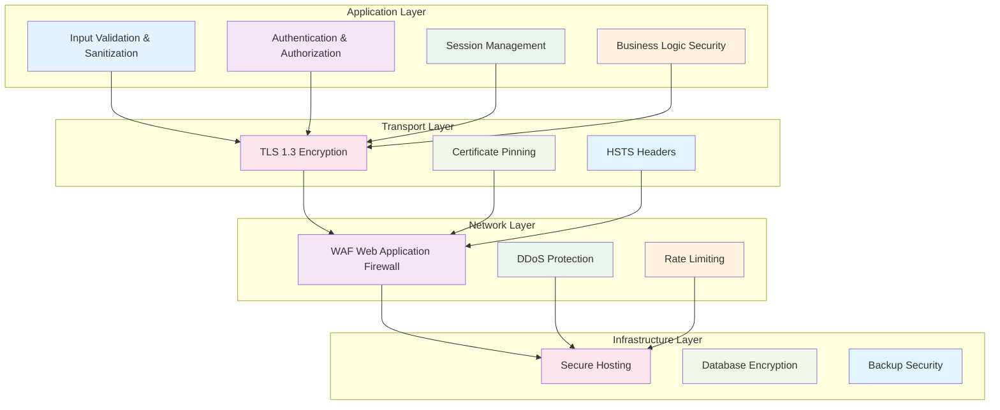

# 🔒 Team Vault - Security Architecture

## 📖 Table of Contents

- [Security Overview](#️-security-overview)
- [Encryption Implementation](#-encryption-implementation)
- [Authentication Security](#-authentication-security)
- [Access Control](#-access-control)
- [Network Security](#-network-security)
- [Data Protection](#-data-protection)
- [Security Monitoring](#-security-monitoring)
- [Compliance](#-compliance)

---

## 🛡️ Security Overview

### 🎯 **Security Principles**

| Principle | Implementation | Purpose |
|-----------|----------------|---------|
| **Defense in Depth** | Multi-layer security controls | Prevent single point of failure |
| **Least Privilege** | Role-based access control | Minimize attack surface |
| **Zero Trust** | Verify every request | Never trust, always verify |
| **Data Minimization** | Collect only necessary data | Reduce exposure risk |
| **Encryption Everywhere** | End-to-end encryption | Protect data in transit and at rest |

### 🔐 **Security Layers**



---

## 🔐 Encryption Implementation

### 🛡️ **Server-Side Encryption (Node.js)**

```typescript
import crypto from 'crypto';

export class EncryptionService {
  private readonly algorithm = 'aes-256-gcm';
  private readonly keyLength = 32;
  private readonly ivLength = 16;
  private readonly tagLength = 16;
  
  constructor(private masterKey: string) {
    if (!masterKey || masterKey.length < 32) {
      throw new Error('Master key must be at least 32 characters');
    }
  }

  encrypt(plaintext: string): string {
    const iv = crypto.randomBytes(this.ivLength);
    const key = crypto.scryptSync(this.masterKey, 'salt', this.keyLength);
    
    const cipher = crypto.createCipherGCM(this.algorithm, key, iv);
    
    let encrypted = cipher.update(plaintext, 'utf8', 'hex');
    encrypted += cipher.final('hex');
    
    const tag = cipher.getAuthTag();
    
    // Format: iv:tag:encrypted
    return `${iv.toString('hex')}:${tag.toString('hex')}:${encrypted}`;
  }

  decrypt(encryptedData: string): string {
    try {
      const [ivHex, tagHex, encrypted] = encryptedData.split(':');
      
      if (!ivHex || !tagHex || !encrypted) {
        throw new Error('Invalid encrypted data format');
      }
      
      const iv = Buffer.from(ivHex, 'hex');
      const tag = Buffer.from(tagHex, 'hex');
      const key = crypto.scryptSync(this.masterKey, 'salt', this.keyLength);
      
      const decipher = crypto.createDecipherGCM(this.algorithm, key, iv);
      decipher.setAuthTag(tag);
      
      let decrypted = decipher.update(encrypted, 'hex', 'utf8');
      decrypted += decipher.final('utf8');
      
      return decrypted;
    } catch (error) {
      throw new Error('Decryption failed: Invalid data or key');
    }
  }

  // Key rotation support
  generateNewKey(): string {
    return crypto.randomBytes(32).toString('hex');
  }

  // Hash for password storage
  hashPassword(password: string): Promise<string> {
    return new Promise((resolve, reject) => {
      crypto.scrypt(password, 'salt', 64, (err, derivedKey) => {
        if (err) reject(err);
        else resolve(derivedKey.toString('hex'));
      });
    });
  }

  // Secure password verification
  verifyPassword(password: string, hash: string): Promise<boolean> {
    return new Promise((resolve, reject) => {
      crypto.scrypt(password, 'salt', 64, (err, derivedKey) => {
        if (err) reject(err);
        else resolve(hash === derivedKey.toString('hex'));
      });
    });
  }
}
```

### 🔒 **Client-Side Encryption (WebCrypto)**

```typescript
export class ClientEncryption {
  private async generateKey(password: string, salt: Uint8Array): Promise<CryptoKey> {
    const encoder = new TextEncoder();
    const keyMaterial = await crypto.subtle.importKey(
      'raw',
      encoder.encode(password),
      'PBKDF2',
      false,
      ['deriveBits', 'deriveKey']
    );

    return crypto.subtle.deriveKey(
      {
        name: 'PBKDF2',
        salt: salt,
        iterations: 100000,
        hash: 'SHA-256',
      },
      keyMaterial,
      { name: 'AES-GCM', length: 256 },
      true,
      ['encrypt', 'decrypt']
    );
  }

  async encrypt(plaintext: string, password: string): Promise<string> {
    try {
      const encoder = new TextEncoder();
      const salt = crypto.getRandomValues(new Uint8Array(16));
      const iv = crypto.getRandomValues(new Uint8Array(12));
      
      const key = await this.generateKey(password, salt);
      
      const encrypted = await crypto.subtle.encrypt(
        { name: 'AES-GCM', iv: iv },
        key,
        encoder.encode(plaintext)
      );

      // Combine salt + iv + encrypted data
      const combined = new Uint8Array(salt.length + iv.length + encrypted.byteLength);
      combined.set(salt, 0);
      combined.set(iv, salt.length);
      combined.set(new Uint8Array(encrypted), salt.length + iv.length);

      return btoa(String.fromCharCode(...combined));
    } catch (error) {
      throw new Error('Client-side encryption failed');
    }
  }

  async decrypt(encryptedData: string, password: string): Promise<string> {
    try {
      const combined = new Uint8Array(
        atob(encryptedData).split('').map(char => char.charCodeAt(0))
      );

      const salt = combined.slice(0, 16);
      const iv = combined.slice(16, 28);
      const encrypted = combined.slice(28);

      const key = await this.generateKey(password, salt);

      const decrypted = await crypto.subtle.decrypt(
        { name: 'AES-GCM', iv: iv },
        key,
        encrypted
      );

      return new TextDecoder().decode(decrypted);
    } catch (error) {
      throw new Error('Client-side decryption failed');
    }
  }

  // Generate secure random password
  generateSecurePassword(length: number = 16): string {
    const charset = 'ABCDEFGHIJKLMNOPQRSTUVWXYZabcdefghijklmnopqrstuvwxyz0123456789!@#$%^&*';
    let password = '';
    
    const array = new Uint8Array(length);
    crypto.getRandomValues(array);
    
    for (let i = 0; i < length; i++) {
      password += charset[array[i] % charset.length];
    }
    
    return password;
  }
}
```

---

## 🔑 Authentication Security

### 🎫 **JWT Token Implementation**

```typescript
import jwt from 'jsonwebtoken';
import crypto from 'crypto';

export class AuthenticationService {
  private readonly accessTokenSecret: string;
  private readonly refreshTokenSecret: string;
  private readonly accessTokenExpiry = '15m';
  private readonly refreshTokenExpiry = '7d';

  constructor() {
    this.accessTokenSecret = process.env.JWT_SECRET!;
    this.refreshTokenSecret = process.env.JWT_REFRESH_SECRET!;
    
    if (!this.accessTokenSecret || !this.refreshTokenSecret) {
      throw new Error('JWT secrets must be configured');
    }
  }

  generateTokens(userId: string, email: string, role: string) {
    const tokenFamily = crypto.randomUUID();
    
    const accessToken = jwt.sign(
      {
        sub: userId,
        email,
        role,
        type: 'access'
      },
      this.accessTokenSecret,
      { expiresIn: this.accessTokenExpiry }
    );

    const refreshToken = jwt.sign(
      {
        sub: userId,
        tokenFamily,
        type: 'refresh'
      },
      this.refreshTokenSecret,
      { expiresIn: this.refreshTokenExpiry }
    );

    return { accessToken, refreshToken, tokenFamily };
  }

  verifyAccessToken(token: string): any {
    try {
      return jwt.verify(token, this.accessTokenSecret);
    } catch (error) {
      throw new Error('Invalid access token');
    }
  }

  verifyRefreshToken(token: string): any {
    try {
      return jwt.verify(token, this.refreshTokenSecret);
    } catch (error) {
      throw new Error('Invalid refresh token');
    }
  }

  // Token rotation for enhanced security
  async rotateRefreshToken(oldRefreshToken: string) {
    const decoded = this.verifyRefreshToken(oldRefreshToken);
    
    // Invalidate old token family to prevent reuse
    await this.invalidateTokenFamily(decoded.tokenFamily);
    
    // Generate new tokens
    return this.generateTokens(decoded.sub, decoded.email, decoded.role);
  }

  private async invalidateTokenFamily(tokenFamily: string) {
    // Implementation to blacklist token family
    // This would typically involve database storage
  }
}
```

### 🛡️ **Password Security**

```typescript
import bcrypt from 'bcrypt';
import zxcvbn from 'zxcvbn';

export class PasswordService {
  private readonly saltRounds = 12;

  async hashPassword(password: string): Promise<string> {
    // Validate password strength
    const strength = zxcvbn(password);
    if (strength.score < 3) {
      throw new Error('Password is too weak');
    }

    return bcrypt.hash(password, this.saltRounds);
  }

  async verifyPassword(password: string, hash: string): Promise<boolean> {
    return bcrypt.compare(password, hash);
  }

  validatePasswordPolicy(password: string): { valid: boolean; errors: string[] } {
    const errors: string[] = [];

    if (password.length < 8) {
      errors.push('Password must be at least 8 characters long');
    }

    if (!/[A-Z]/.test(password)) {
      errors.push('Password must contain at least one uppercase letter');
    }

    if (!/[a-z]/.test(password)) {
      errors.push('Password must contain at least one lowercase letter');
    }

    if (!/\d/.test(password)) {
      errors.push('Password must contain at least one number');
    }

    if (!/[!@#$%^&*(),.?":{}|<>]/.test(password)) {
      errors.push('Password must contain at least one special character');
    }

    // Check against common passwords
    const strength = zxcvbn(password);
    if (strength.score < 3) {
      errors.push('Password is too common or predictable');
    }

    return {
      valid: errors.length === 0,
      errors
    };
  }
}
```

---

## 🔐 Access Control

### 🛡️ **Role-Based Access Control (RBAC)**

```typescript
export enum Role {
  USER = 'user',
  GLOBAL_ADMIN = 'globalAdmin'
}

export enum TeamRole {
  VIEWER = 'viewer',
  EDITOR = 'editor',
  ADMIN = 'admin'
}

export enum Permission {
  // Credential permissions
  CREATE_CREDENTIAL = 'credential:create',
  READ_CREDENTIAL = 'credential:read',
  UPDATE_CREDENTIAL = 'credential:update',
  DELETE_CREDENTIAL = 'credential:delete',
  SHARE_CREDENTIAL = 'credential:share',
  
  // Team permissions
  CREATE_TEAM = 'team:create',
  READ_TEAM = 'team:read',
  UPDATE_TEAM = 'team:update',
  DELETE_TEAM = 'team:delete',
  MANAGE_MEMBERS = 'team:manage_members',
  
  // Admin permissions
  MANAGE_USERS = 'admin:manage_users',
  VIEW_AUDIT_LOGS = 'admin:view_audit_logs',
  SYSTEM_CONFIG = 'admin:system_config'
}

export class AccessControlService {
  private rolePermissions: Map<Role, Permission[]> = new Map([
    [Role.USER, [
      Permission.CREATE_CREDENTIAL,
      Permission.READ_CREDENTIAL,
      Permission.UPDATE_CREDENTIAL,
      Permission.DELETE_CREDENTIAL,
      Permission.SHARE_CREDENTIAL,
      Permission.CREATE_TEAM,
      Permission.READ_TEAM,
      Permission.UPDATE_TEAM,
      Permission.DELETE_TEAM,
      Permission.MANAGE_MEMBERS
    ]],
    [Role.GLOBAL_ADMIN, [
      ...Object.values(Permission) // All permissions
    ]]
  ]);

  private teamRolePermissions: Map<TeamRole, Permission[]> = new Map([
    [TeamRole.VIEWER, [
      Permission.READ_CREDENTIAL,
      Permission.READ_TEAM
    ]],
    [TeamRole.EDITOR, [
      Permission.READ_CREDENTIAL,
      Permission.UPDATE_CREDENTIAL,
      Permission.SHARE_CREDENTIAL,
      Permission.READ_TEAM
    ]],
    [TeamRole.ADMIN, [
      Permission.READ_CREDENTIAL,
      Permission.UPDATE_CREDENTIAL,
      Permission.DELETE_CREDENTIAL,
      Permission.SHARE_CREDENTIAL,
      Permission.READ_TEAM,
      Permission.UPDATE_TEAM,
      Permission.MANAGE_MEMBERS
    ]]
  ]);

  hasPermission(userRole: Role, permission: Permission): boolean {
    const permissions = this.rolePermissions.get(userRole);
    return permissions?.includes(permission) ?? false;
  }

  hasTeamPermission(teamRole: TeamRole, permission: Permission): boolean {
    const permissions = this.teamRolePermissions.get(teamRole);
    return permissions?.includes(permission) ?? false;
  }

  canAccessCredential(
    userId: string,
    credential: any,
    sharedCredentials: any[],
    action: Permission
  ): boolean {
    // Owner has full access
    if (credential.ownerId === userId) {
      return true;
    }

    // Check shared access
    const sharedAccess = sharedCredentials.find(sc => 
      sc.credentialId === credential.id && 
      (sc.sharedWithUserId === userId || sc.sharedWithTeamId) &&
      (!sc.expiresAt || new Date(sc.expiresAt) > new Date())
    );

    if (!sharedAccess) {
      return false;
    }

    // Check access level permissions
    if (action === Permission.READ_CREDENTIAL) {
      return true; // Both view and edit allow reading
    }

    if (action === Permission.UPDATE_CREDENTIAL) {
      return sharedAccess.accessLevel === 'edit';
    }

    return false;
  }
}
```

### 🔒 **Authorization Middleware**

```typescript
import { Request, Response, NextFunction } from 'express';

export interface AuthenticatedRequest extends Request {
  user: {
    id: string;
    email: string;
    role: Role;
  };
}

export const authMiddleware = (
  req: AuthenticatedRequest,
  res: Response,
  next: NextFunction
) => {
  try {
    const token = req.headers.authorization?.replace('Bearer ', '');
    
    if (!token) {
      return res.status(401).json({
        error: {
          code: 'UNAUTHORIZED',
          message: 'Authentication token required'
        }
      });
    }

    const decoded = jwt.verify(token, process.env.JWT_SECRET!);
    req.user = decoded as any;
    
    next();
  } catch (error) {
    return res.status(401).json({
      error: {
        code: 'UNAUTHORIZED',
        message: 'Invalid or expired token'
      }
    });
  }
};

export const requirePermission = (permission: Permission) => {
  return (req: AuthenticatedRequest, res: Response, next: NextFunction) => {
    const accessControl = new AccessControlService();
    
    if (!accessControl.hasPermission(req.user.role, permission)) {
      return res.status(403).json({
        error: {
          code: 'FORBIDDEN',
          message: 'Insufficient permissions'
        }
      });
    }
    
    next();
  };
};

export const requireRole = (role: Role) => {
  return (req: AuthenticatedRequest, res: Response, next: NextFunction) => {
    if (req.user.role !== role) {
      return res.status(403).json({
        error: {
          code: 'FORBIDDEN',
          message: 'Access denied'
        }
      });
    }
    
    next();
  };
};
```

---

## 🌐 Network Security

### 🛡️ **Security Headers Configuration**

```typescript
import helmet from 'helmet';
import { Express } from 'express';

export const configureSecurityHeaders = (app: Express) => {
  app.use(helmet({
    contentSecurityPolicy: {
      directives: {
        defaultSrc: ["'self'"],
        styleSrc: ["'self'", "'unsafe-inline'"],
        scriptSrc: ["'self'"],
        imgSrc: ["'self'", "data:", "https:"],
        connectSrc: ["'self'"],
        fontSrc: ["'self'"],
        objectSrc: ["'none'"],
        mediaSrc: ["'self'"],
        frameSrc: ["'none'"],
        baseUri: ["'self'"],
        formAction: ["'self'"],
        frameAncestors: ["'none'"],
        upgradeInsecureRequests: [],
      },
    },
    hsts: {
      maxAge: 31536000, // 1 year
      includeSubDomains: true,
      preload: true
    },
    noSniff: true,
    xssFilter: true,
    referrerPolicy: { 
      policy: 'same-origin' 
    },
    crossOriginEmbedderPolicy: false, // Disable for API compatibility
    crossOriginResourcePolicy: { 
      policy: 'cross-origin' 
    }
  }));

  // Additional security headers
  app.use((req, res, next) => {
    res.setHeader('X-Content-Type-Options', 'nosniff');
    res.setHeader('X-Frame-Options', 'DENY');
    res.setHeader('X-XSS-Protection', '1; mode=block');
    res.setHeader('Strict-Transport-Security', 'max-age=31536000; includeSubDomains; preload');
    res.setHeader('Permissions-Policy', 'camera=(), microphone=(), geolocation=()');
    next();
  });
};
```

### 🚦 **Rate Limiting Implementation**

```typescript
import { RateLimiterRedis } from 'rate-limiter-flexible';
import Redis from 'ioredis';

const redisClient = new Redis(process.env.REDIS_URL);

// Login attempt limiter
export const loginLimiter = new RateLimiterRedis({
  storeClient: redisClient,
  keyPrefix: 'login_fail',
  points: 5, // Number of attempts
  duration: 900, // Per 15 minutes
  blockDuration: 900, // Block for 15 minutes
});

// General API limiter
export const apiLimiter = new RateLimiterRedis({
  storeClient: redisClient,
  keyPrefix: 'api_call',
  points: 100, // Number of requests
  duration: 60, // Per minute
});

// Search API limiter (more restrictive)
export const searchLimiter = new RateLimiterRedis({
  storeClient: redisClient,
  keyPrefix: 'search_call',
  points: 20,
  duration: 60,
});

// File upload limiter
export const uploadLimiter = new RateLimiterRedis({
  storeClient: redisClient,
  keyPrefix: 'upload_call',
  points: 5,
  duration: 300, // 5 minutes
});

export const rateLimitMiddleware = (limiter: RateLimiterRedis) => {
  return async (req: Request, res: Response, next: NextFunction) => {
    try {
      await limiter.consume(req.ip);
      next();
    } catch (rejRes) {
      const secs = Math.round(rejRes.msBeforeNext / 1000) || 1;
      res.set('Retry-After', String(secs));
      res.status(429).json({
        error: {
          code: 'RATE_LIMITED',
          message: 'Too many requests',
          details: { retryAfter: secs }
        }
      });
    }
  };
};
```

---

## 🔐 Data Protection

### 🗄️ **Database Security**

```typescript
// Database configuration with security settings
export const databaseConfig = {
  // Connection security
  ssl: {
    require: true,
    rejectUnauthorized: true,
    ca: process.env.DB_CA_CERT,
    cert: process.env.DB_CLIENT_CERT,
    key: process.env.DB_CLIENT_KEY
  },
  
  // Connection pooling
  pool: {
    min: 2,
    max: 10,
    createTimeoutMillis: 8000,
    acquireTimeoutMillis: 8000,
    idleTimeoutMillis: 8000,
    reapIntervalMillis: 1000,
    createRetryIntervalMillis: 100
  },

  // Query logging for security monitoring
  logging: (query: string, time: number) => {
    if (time > 1000) { // Log slow queries
      console.warn(`Slow query detected: ${query} (${time}ms)`);
    }
  }
};

// Sensitive data handling
export class DataProtectionService {
  // Sanitize data before logging
  sanitizeForLogging(data: any): any {
    const sanitized = { ...data };
    
    // Remove sensitive fields
    const sensitiveFields = [
      'password', 'secret', 'token', 'key', 
      'encryptedSecret', 'passwordHash'
    ];
    
    sensitiveFields.forEach(field => {
      if (sanitized[field]) {
        sanitized[field] = '[REDACTED]';
      }
    });
    
    return sanitized;
  }

  // Secure data deletion
  async secureDelete(tableName: string, id: string) {
    // Overwrite sensitive data before deletion
    await this.overwriteSensitiveData(tableName, id);
    
    // Actual deletion
    await this.performDeletion(tableName, id);
    
    // Audit the deletion
    await this.auditDeletion(tableName, id);
  }

  private async overwriteSensitiveData(tableName: string, id: string) {
    // Implementation specific to table structure
    // Overwrite with random data multiple times
  }
}
```

### 📋 **Audit Logging**

```typescript
export interface AuditLogEntry {
  userId?: string;
  action: string;
  resourceType: string;
  resourceId?: string;
  details?: any;
  ipAddress?: string;
  userAgent?: string;
  timestamp: Date;
}

export class AuditService {
  private dataProtection = new DataProtectionService();

  async log(entry: AuditLogEntry): Promise<void> {
    try {
      // Sanitize sensitive data
      const sanitizedDetails = this.dataProtection.sanitizeForLogging(entry.details);
      
      await this.prisma.auditLog.create({
        data: {
          ...entry,
          details: sanitizedDetails,
          timestamp: new Date()
        }
      });
    } catch (error) {
      // Log audit failures to a separate system
      console.error('Audit logging failed:', error);
    }
  }

  // Security event logging
  async logSecurityEvent(event: {
    type: 'LOGIN_FAILURE' | 'TOKEN_THEFT' | 'SUSPICIOUS_ACTIVITY' | 'UNAUTHORIZED_ACCESS';
    userId?: string;
    details: any;
    severity: 'LOW' | 'MEDIUM' | 'HIGH' | 'CRITICAL';
    ipAddress?: string;
  }) {
    await this.log({
      userId: event.userId,
      action: `SECURITY_${event.type}`,
      resourceType: 'security',
      details: {
        ...event.details,
        severity: event.severity
      },
      ipAddress: event.ipAddress
    });

    // Alert on high severity events
    if (event.severity === 'HIGH' || event.severity === 'CRITICAL') {
      await this.alertSecurityTeam(event);
    }
  }

  private async alertSecurityTeam(event: any) {
    // Implementation for security team alerting
    // Email, Slack, PagerDuty, etc.
  }
}
```

---

## 📊 Security Monitoring

### 🔍 **Security Metrics Dashboard**

```typescript
export class SecurityMetricsService {
  async getSecurityMetrics(timeRange: string) {
    const endDate = new Date();
    const startDate = this.getStartDate(timeRange);

    const metrics = await Promise.all([
      this.getFailedLoginAttempts(startDate, endDate),
      this.getSuspiciousActivities(startDate, endDate),
      this.getTokenTheftAttempts(startDate, endDate),
      this.getUnauthorizedAccessAttempts(startDate, endDate),
      this.getCredentialAccessPatterns(startDate, endDate)
    ]);

    return {
      failedLogins: metrics[0],
      suspiciousActivities: metrics[1],
      tokenTheft: metrics[2],
      unauthorizedAccess: metrics[3],
      credentialAccess: metrics[4],
      riskScore: this.calculateRiskScore(metrics)
    };
  }

  private async getFailedLoginAttempts(start: Date, end: Date) {
    return this.prisma.auditLog.count({
      where: {
        action: 'LOGIN_FAILURE',
        timestamp: {
          gte: start,
          lte: end
        }
      }
    });
  }

  private calculateRiskScore(metrics: any[]): number {
    // Risk scoring algorithm
    const weights = {
      failedLogins: 0.2,
      suspiciousActivities: 0.3,
      tokenTheft: 0.4,
      unauthorizedAccess: 0.1
    };

    // Implementation of risk calculation
    return 0; // Placeholder
  }
}
```

### 🚨 **Intrusion Detection**

```typescript
export class IntrusionDetectionService {
  private suspiciousPatterns = [
    {
      name: 'Rapid Failed Logins',
      check: this.checkRapidFailedLogins.bind(this),
      severity: 'HIGH'
    },
    {
      name: 'Unusual Access Patterns',
      check: this.checkUnusualAccessPatterns.bind(this),
      severity: 'MEDIUM'
    },
    {
      name: 'Token Reuse Detection',
      check: this.checkTokenReuse.bind(this),
      severity: 'CRITICAL'
    }
  ];

  async analyzeUserActivity(userId: string, ipAddress: string) {
    for (const pattern of this.suspiciousPatterns) {
      const detected = await pattern.check(userId, ipAddress);
      
      if (detected) {
        await this.handleSuspiciousActivity({
          pattern: pattern.name,
          severity: pattern.severity,
          userId,
          ipAddress,
          details: detected
        });
      }
    }
  }

  private async checkRapidFailedLogins(userId: string, ipAddress: string) {
    const recentFailures = await this.prisma.auditLog.count({
      where: {
        userId,
        action: 'LOGIN_FAILURE',
        ipAddress,
        timestamp: {
          gte: new Date(Date.now() - 15 * 60 * 1000) // Last 15 minutes
        }
      }
    });

    return recentFailures > 5 ? { count: recentFailures } : null;
  }

  private async checkUnusualAccessPatterns(userId: string, ipAddress: string) {
    // Check for access from unusual locations/times
    // Implementation depends on historical data analysis
    return null;
  }

  private async checkTokenReuse(userId: string, ipAddress: string) {
    // Check for JWT token replay attacks
    // Implementation involves tracking token usage
    return null;
  }

  private async handleSuspiciousActivity(activity: any) {
    // Log the activity
    await this.auditService.logSecurityEvent({
      type: 'SUSPICIOUS_ACTIVITY',
      userId: activity.userId,
      details: activity,
      severity: activity.severity,
      ipAddress: activity.ipAddress
    });

    // Take automatic actions based on severity
    if (activity.severity === 'CRITICAL') {
      await this.lockUserAccount(activity.userId);
      await this.invalidateUserTokens(activity.userId);
    }
  }
}
```

---

## 📋 Compliance

### 🛡️ **GDPR Compliance**

```typescript
export class GDPRComplianceService {
  // Right to access personal data
  async exportUserData(userId: string): Promise<any> {
    const userData = await this.prisma.user.findUnique({
      where: { id: userId },
      include: {
        credentials: {
          select: {
            id: true,
            name: true,
            category: true,
            createdAt: true,
            updatedAt: true
            // Exclude encrypted secrets
          }
        },
        teamMemberships: {
          include: {
            team: {
              select: { name: true }
            }
          }
        },
        auditLogs: {
          select: {
            action: true,
            timestamp: true,
            ipAddress: true
          }
        }
      }
    });

    return {
      personalData: userData,
      exportDate: new Date().toISOString(),
      dataController: 'Team Vault Inc.',
      legalBasis: 'Legitimate interest for security management'
    };
  }

  // Right to rectification
  async updateUserData(userId: string, updates: any): Promise<void> {
    await this.prisma.user.update({
      where: { id: userId },
      data: updates
    });

    await this.auditService.log({
      userId,
      action: 'USER_DATA_UPDATED',
      resourceType: 'user',
      resourceId: userId,
      details: { updatedFields: Object.keys(updates) }
    });
  }

  // Right to erasure (right to be forgotten)
  async deleteUserData(userId: string): Promise<void> {
    // 1. Transfer ownership of shared credentials
    await this.transferCredentialOwnership(userId);

    // 2. Remove from team memberships
    await this.prisma.teamMembership.deleteMany({
      where: { userId }
    });

    // 3. Anonymize audit logs (preserve for security but remove personal identifiers)
    await this.anonymizeAuditLogs(userId);

    // 4. Delete user account
    await this.prisma.user.delete({
      where: { id: userId }
    });

    // 5. Log the deletion
    await this.auditService.log({
      action: 'USER_DATA_DELETED',
      resourceType: 'user',
      resourceId: userId,
      details: { reason: 'GDPR_RIGHT_TO_ERASURE' }
    });
  }

  private async transferCredentialOwnership(userId: string): Promise<void> {
    // Implementation to transfer credentials to team or delete them
  }

  private async anonymizeAuditLogs(userId: string): Promise<void> {
    await this.prisma.auditLog.updateMany({
      where: { userId },
      data: { userId: null } // Keep logs but remove user association
    });
  }
}
```

### 🔒 **SOC 2 Compliance Features**

```typescript
export class SOC2ComplianceService {
  // Security controls documentation
  async generateSecurityControlsReport(): Promise<any> {
    return {
      accessControls: await this.documentAccessControls(),
      dataEncryption: await this.documentEncryptionControls(),
      changeManagement: await this.documentChangeManagement(),
      incidentResponse: await this.documentIncidentResponse(),
      monitoring: await this.documentMonitoringControls()
    };
  }

  private async documentAccessControls() {
    return {
      userAuthentication: 'Multi-factor authentication required',
      roleBasedAccess: 'Implemented with least privilege principle',
      sessionManagement: 'Secure session handling with timeout',
      privilegedAccess: 'Admin access logged and monitored'
    };
  }

  // Data retention policies
  async enforceDataRetention(): Promise<void> {
    // Delete old audit logs beyond retention period
    const retentionPeriod = new Date();
    retentionPeriod.setFullYear(retentionPeriod.getFullYear() - 7); // 7 years

    await this.prisma.auditLog.deleteMany({
      where: {
        timestamp: {
          lt: retentionPeriod
        }
      }
    });

    // Archive old user data
    await this.archiveInactiveUsers();
  }

  private async archiveInactiveUsers(): Promise<void> {
    const inactiveThreshold = new Date();
    inactiveThreshold.setFullYear(inactiveThreshold.getFullYear() - 2); // 2 years

    const inactiveUsers = await this.prisma.user.findMany({
      where: {
        lastLoginAt: {
          lt: inactiveThreshold
        },
        isActive: false
      }
    });

    // Implementation for archiving inactive users
  }
}
```

---

*This security architecture document provides comprehensive guidance for implementing secure credential management. Regular security reviews and updates are essential as threats evolve.*
